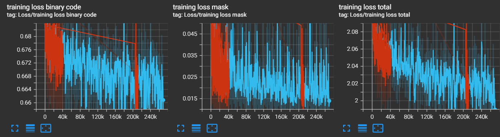

# Zebra Pose

This project is based on the Zebra Pose model

[https://arxiv.org/abs/2203.09418](https://arxiv.org/abs/2203.09418)

code:[https://github.com/suyz526/ZebraPose?tab=readme-ov-file](https://github.com/suyz526/ZebraPose?tab=readme-ov-file)

# Modifications to the original scripts

In order to make the solution works on a windows machine with numpy > 1.21 some modifications where done to the code.

The biggest one is the replace of float and int value type that are deprecated on the newer version of numpy.

Some other minor modifications where made to make sure the scripts works correctly with the provided configuration. Some of them consist of handle edge cases in case of path with spaces

## Demo


### Library installations

```bash
sudo apt install libeigen3-dev
sudo apt-get install libgflags-dev
sudo apt-get -y install libgoogle-glog-dev
sudo apt install libopencv-dev
```

# New Scripts

## Get camera calibration

get_matrix_camlibration.py script is used to calibrate the camera, it search for a checkerboard and get the camera intrinsic matrix

## On camera tracking script

track_and_send.py is a new python script added to use the functions provided by the zpose library to run the tracking on the camera stream for the corresponded object.

First of all this script gathers all the necessary configurations and build the network.

After that a TCP server is created waiting for a connection from the client that will consume the tracking information.

When the connection is established the selected camera will be activated and the tracking of the selected object will start on that stream. The tracking information are given to the client in an unsolicited manner, after the connection is established.

to run the script use the following command (make sure to set all the configuration option correctly)

```bash
sudo python track_and_send.py --cfg config/custom_config/laryngoscope.txt --obj_name laryngoscope --ckpt_file ../experiments/checkpoints/ycbv_effnetb4/large_marker/best_score/0_1049step584000
```

# Setup

Before using the solution the instructions on the main readme file should be followed to make sure that all the requirement are satisfied.

To sum up the most important steps are:

- Compile the bop toolkit library and the progressive-x library
- After that, download the pretrained weights from the source indicated on the readme. It is not really necessary to download any dataset (if needed the best solution should be to download the YCBV dataset).
- Compile the Binary_Code_GT_Generator following the readme on that folder

## WSL configuration

The solution work on linux, so WSL is used. Build WSL ubuntu to make it work with computer usb camera.

### Setup the WSL

- Install on windows **`usbipd-win`**  [https://github.com/dorssel/usbipd-win/wiki/WSL-support](https://github.com/dorssel/usbipd-win/wiki/WSL-support)
- follow the steps in this repository to make the camera works on WSL: https://github.com/PINTO0309/wsl2_linux_kernel_usbcam_enable_conf

### Activate camera on WSL

search for usb devices:

```powershell
usbipd wsl list 
```

Find the usb devices associated to the camera and execute the code (replace <busID> with the founded id)

```powershell
usbipd attach --wsl --busid <busID>
```

After this operation the camera could be used by WSL but not by Windows. To de touch the camera from WSL use:

```powershell
usbipd detach --wsl --busid <busID>
```

### Opencv camera capture

However, to make Opencv camera capture works a new instruction is needed:

before opening the camera stream add the instruction:

```python
cam = cv2.VideoCapture(0)
cam.set(cv2.CAP_PROP_FOURCC, cv2.VideoWriter_fourcc(*'MJPG'))
```

then 

```python
cam.read()
```

to capture a frame from the camera.

Finally

```python
cam.release()
```

To release the camera

# Synthetic data generation

To train the model, synthetic data can be used.

Several Blender files have been created to generate the required images for training and testing.

In the `/syntheticDatasetGeneration` directory, the following Blender files are available:

- `GenerateDataset.blend`
- `GenerateDataset_NEW.blend`
- `GenerateTestSet.blend`

By opening these Blender files and executing the corresponding scripts, it is possible to automatically generate a series of images suitable for model training.

Before running the scripts, make sure to **edit the first lines of the script** to set the appropriate parameters (e.g., output paths, number of samples, rendering options, etc.).

Each Blender file produces slightly different results, due to variations in configuration and generation parameters.

To generate dataset with a different model, import the 3D model in the blender file and rename it accordingly to the name of the main object already present in the file


# Custom dataset

The following points describes how to create a new dataset from scratch:

- Preprocess the CAD model
    - Scan the object or create a CAD model
    - Create the .obj file and the ply file according to the readme Generate_GT and put them on the bop_root_folder/dataset_folder/models
        - the names of the two files will be obj_{obj_id:06d} (es. obj_000001.ply)
    - Create a camera.json file in bop_root_folder/dataset_folder, following the bop documentation, of a camera that will be use in simulations. (the simplest way is to copy the camera.json of another dataset)
    - Generate the model_info.json:
        - Edit the script `bop_toolkit/scripts/calc_model_info.py` . set the dataset and dataset_path params in the structure at line 13
        - Edit the script `bop_toolkit/bop_toolkit_lib/dataset_params.py` : edit the structures `obj_ids`  and `symmetric_obj_ids` at line 75, add a new line with the dataset name and the list of objects ids
        - Edit the file `zebrapose/tools_for_BOP/common_dataset_info.py` adding 2 structures (substitute `<dataset>` with the name of the dataset and `<object_name>` with the name of the object):
            - `<dataset>_obj_name_obj_id = {'<object_name>':1}`
            - `<dataset>_symmetry_obj = {'<object_name>':1}`
            
            edit the `get_obj_info` function at the end of the file adding the name of the dataset to the array in the check condition
            
        
        Execute the script `python3 ../bop_toolkit/scripts/calc_model_info.py`
        
    - then run the `generate_mesh_with_GT_color_for_BOP.py` script accordingly to the documentation
- Create the configuration file
    - use as model the zebrapose/config/customconfig/laryngoscope.txt file
- Create the images and labels
    - Use the above-described method to generate the synthetic images
    - Run the **ConvertToYoloFormat.py** to generate the labels to train the YOLO model
- Use the python script file Generate_GT
    
    I’ve created a python script to generate the GT, this will render the model with GT colors generated in the previous steps. I’ve used Open3d as a renderer (for some reason Blender add a noise to the render so it could not be usable).
    
    On top of the file there are the configuration variables
    
    - add the path to the model of the model_GT_color
    - Change the folder in the script with the name of the folder you want to get the information from
    - Run the script `python Generate_GT.py`
- [Alternative 1] Use the Blender file  `Generate_GT.blend` and run the script in the file
    - This script doesn’t really work for me
    
- [Alternative 2] Run `generate_training_labels_for_BOP.py` script accordingly to the ZebraPose documentation

### Example of GT image


### Training

#### activate Venv
`source venv/Scripts/activate`

### Run Script
Adjust the paths in the config files, and train the network with `train.py`, e.g.

`python train.py --cfg config/config_BOP/lmo/exp_lmo_BOP.txt --obj_name ape`

`python3 train.py --cfg config/config_BOP/ycbv/exp_ycbv_BOP.txt --obj_name ape`

`python3 train.py --cfg config/config_BOP_effnet/ycbv/ycbv_BOP_effnet_train.txt --obj_name mug`

The script will save the last 3 checkpoints and the best checkpoint, as well as tensorboard log. To enable sym. aware training, with `--sym_aware_training True`

## Run script track and send
`sudo python track_and_send.py --cfg config/config_BOP_effnet/ycbv/ycbv_BOP_effnet_train.txt --obj_name large_marker --ckpt_file ../experiments/checkpoints/ycbv_effnetb4/large_marker/best_score/0_1049step584000`

## Test with trained model
For most datasets, a specific object occurs only once in a test images. 

`python test.py --cfg config/config_BOP/lmo/exp_lmo_BOP.txt --obj_name ape --ckpt_file path/to/the/best/checkpoint --ignore_bit 0 --eval_output_path path/to/save/the/evaluation/report`

`python3 test.py --cfg config/config_BOP_effnet/ycbv/ycbv_BOP_effnet_train.txt --obj_name mug --ckpt_file ../experiments/checkpoints/ycbv_effnetb4/mug/best_score/0_6101step497000 --ignore_bit 0 --eval_output_path ../evaluation/BOP_effnet/ycbv/eval`

To use ICP for refinement, use `--use_icp True`

For datasets like tless, the number of a a specific object is unknown in the test stage.

`python test_vivo.py --cfg config/config_BOP/tless/exp_tless_BOP.txt --ckpt_file path/to/the/best/checkpoint --ignore_bit 0 --obj_name obj01 --eval_output_path path/to/save/the/evaluation/report`

To use ICP for refinement, use `--use_icp True`


# Training experiments zebra pose

The aim of the experiments is to train the zebra pose model with the synthetic laryngoscope dataset.
the dataset consists in 10000 images of the object in different light conditions and occlusions, with a random background image.

the experiments consists on training the network starting from a pretrained checkpoint.

the checkpoint used is the large_marker best score checkpoint of the ycbv dataset provided by the zebra pose developers.

# First tests

## Transfer learning

This experiments consists on freezing the first layers of the network, training only the last ones.

- 1/2 of layers frozen (red)
- 2/3 of layers frozen (blue)




Even dough the red chart misses the central part it is clear that both of the tests had a very similar results in term of losses.

The qualitative results are that the segmentation works really well but the positions and rotations are not correct (the error shows that the predicted results doesn’t really get bette rover time).

## Training on pretrained model

This experiments consists on starting from the pretrained model without freezing the layer.

the qualitative results and the corrisponding charts are similar. But the loss is in general lower than the transfer learning one 


### Example of expected error chart


### Possible problems

- The generated GT labels aren’t correct (the script to generate them was completely recreated from scratch)
- The pretrained model is interfering with the learning of the correct features

# Second tests

## Fixing the GT and new error calculation

The GT labels were generated using Blender. For some reason Blender added a random pattern of 1,1,1 pixel in the part of the image that should be black. Due to the fact that each pixel represent a specific code, this can create errors in the losses.

Label without the fix:


Label with the fix:


The script that generate this labels is modified to make all this pixels black.

The next tests where conducted with this new fix.

Furthermore a new error is computed based on the mean square error of the raw rotation and translations data collected during tests and training

### Train on single image

The goal of this tests is to understand if the model  can actually fit on a single image.

below the chart of the error of raw rotation and translation data


With a few iteration steps the model can predict the pose of the object quite well.

Also the ADD error chart indicates that the model can fit on a single image


### Train on the entire dataset

Two test were conducted on the entire dataset:

- No pretrained weights
    - adi error
        
        
        
    - raw errors on rotations and translations
    
    
    
    the adi error and the error on the translation are really high. This means that most of the time the model can’t actually predict a solution at all.
    
- With pretrained weights and freezing 0.67 of the network
    - adi error
        
        
        
    - raw errors on rotations and translations
        
        
        
        the results are similar to the previous ones
        

# Third test

## Fixing the GT

The GT images were rendered using Blender, for some reason Blender add noise to the image messing up the colors of the generated GT.

A new python script was created. Open3d was used as a renderer.

## Fixing the CAD Model

As a comparison to the model provided by the paper the CAD model that was used had too many polygons. Rremesh and the decimate modifier of Blender are used to create a new model with a simpler geometry. Using sculpture mode to refine some areas and to add geometry to others.

Running the training with the new GT on the old dataset generate bad results. So probably the images are too complex for the model to detect a correct position and translation

### Training 100 images

A new dataset was created. It is composed of 100 images of the laryngoscope with a low amount of colluders and a white background.

After 23K steps a clear sign of overfitting was emerging. In fact the error is quite low on the train but a bit high on the test

- Train


- Test


### Training 1000 images

A new dataset was generated creating 1000 images with a changing background and more colluders

The results are good, with an high error on the translation.

The training probably suffer of underfitting (high bias) probably due to the small dataset

- Test
    
    
    
- Train
    
    
